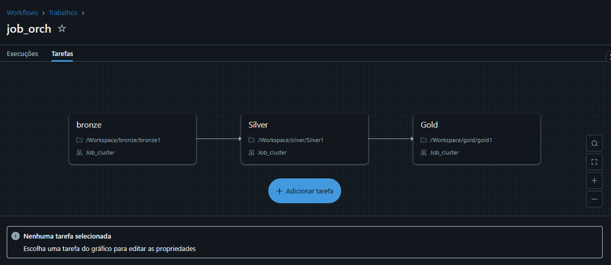
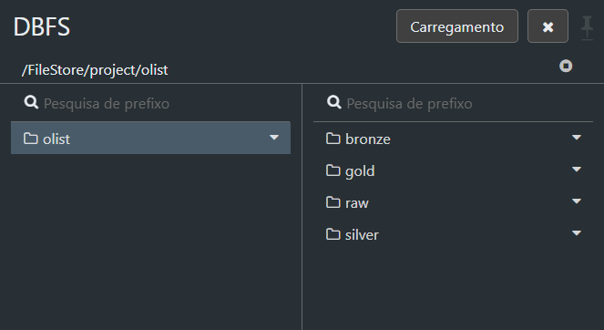
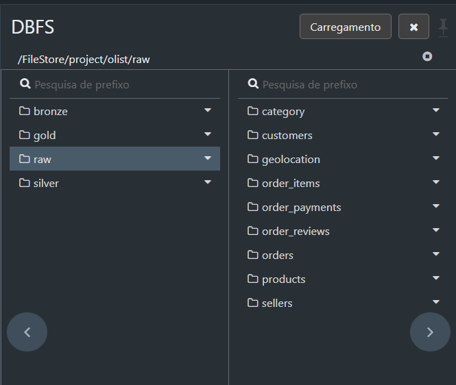
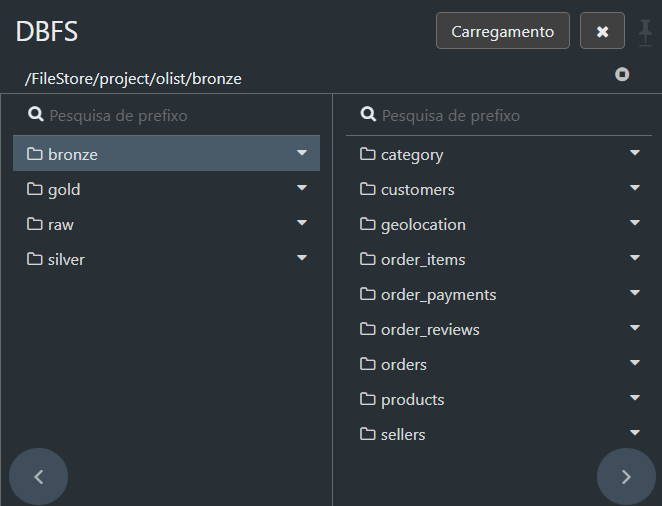
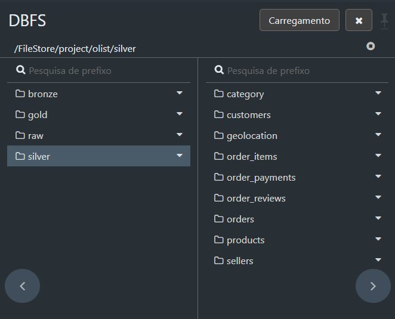
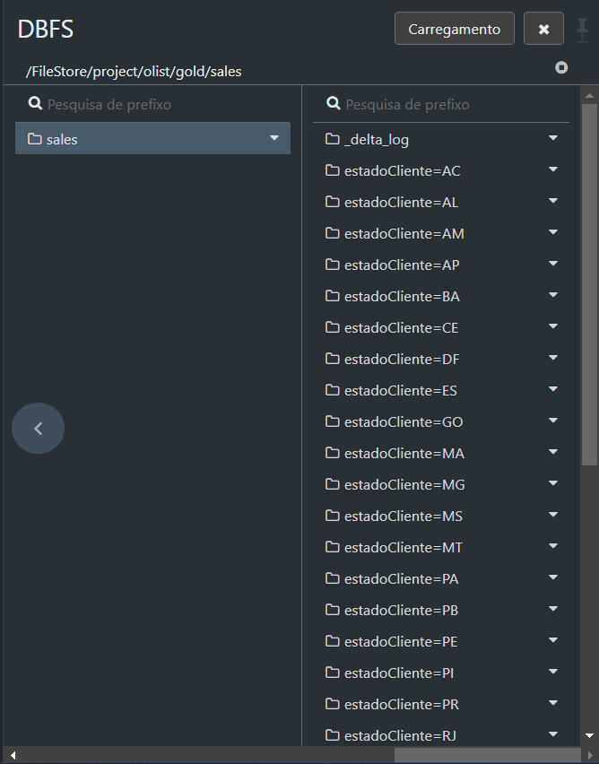
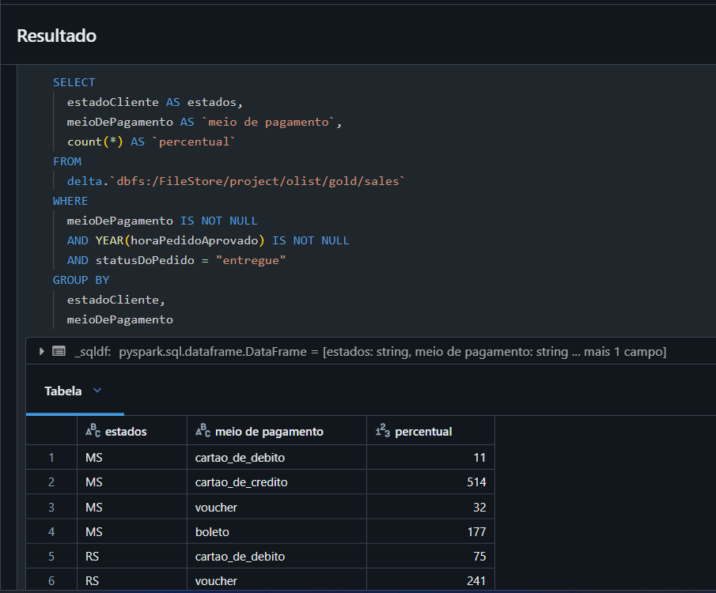
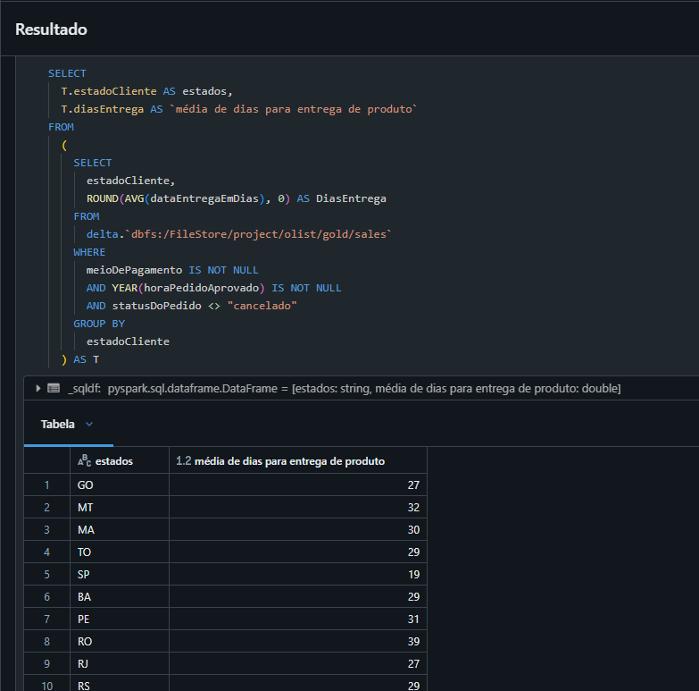
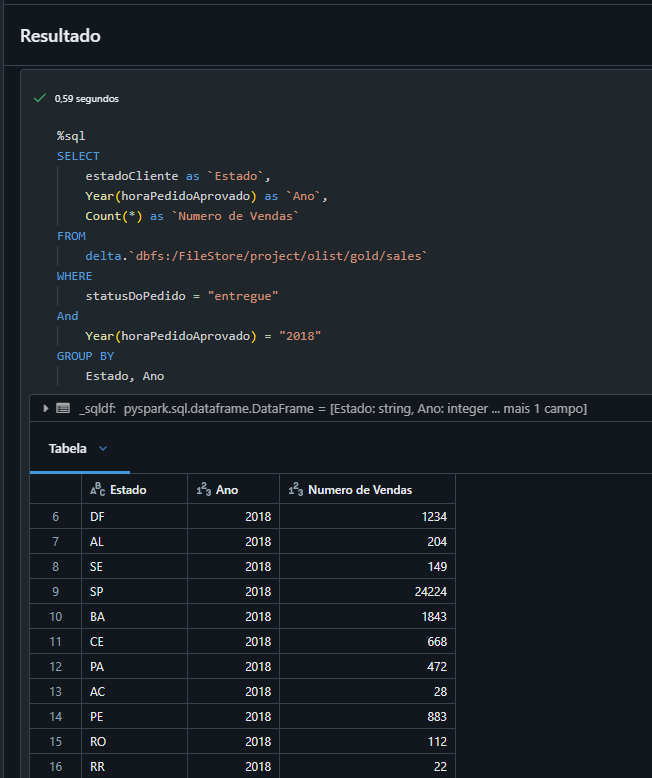
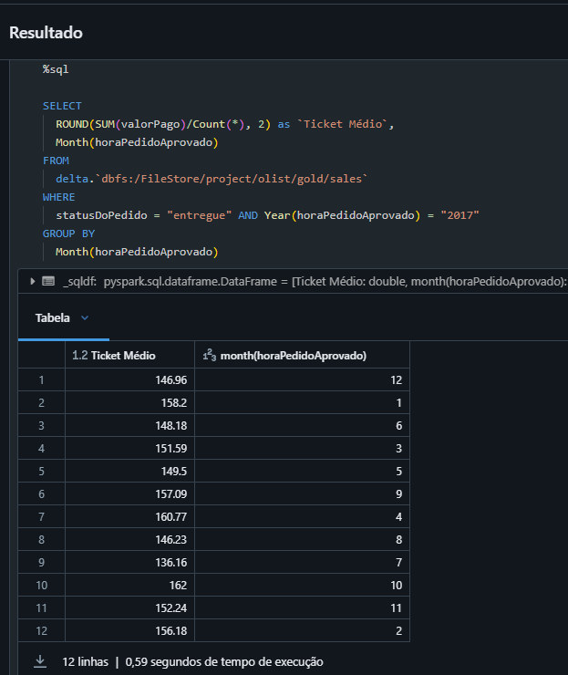

Eu sou o Emmanuel Orestes Torres ([Linkedin](https://www.linkedin.com/in/emmanuel-orestes-torres-038a5869/)).

Este repositório contém informações detalhadas sobre o meu teste técnico para Engenharia de Dados.

##  DataSet
Para realizar o teste técnico, escolhi o [Brazilian E-Commerce Public Dataset by Olist](https://www.kaggle.com/datasets/olistbr/brazilian-ecommerce).

Github com a dataset [Github by Olist](https://raw.githubusercontent.com/olist/work-at-olist-data/master/datasets/). 

O diagrama de entidade e relacionamento foi fornecido:

## Bronze
[Arquivos da camada bronze](./bronze)
Arquivos da camada Bronze. Neste notebook .ipynb, os dados são processados diretamente da camada RAW para a camada Bronze no Databricks File System (DBFS). 

O workflow segue as seguintes etapas:
Leitura de Dados Brutos
Importação de arquivos CSV armazenados na camada RAW.
Estruturação inicial dos dados utilizando esquemas definidos no PySpark.
Validação e Transformação dos Dados

Verifica a integridade e consistência dos dados brutos.
Aplica transformações específicas, como tratamento de valores nulos e ajuste de formatos, para adequação ao modelo da camada Bronze.
Persistência na Camada Bronze

Salva os dados limpos e estruturados na camada Bronze, garantindo que estejam prontos para processamento na camada Silver.
Comportamento do Workflow
Dados válidos e consistentes: O job é executado com sucesso e a camada Bronze é atualizada.
Erro nos dados ou ausência de arquivos: O processo é interrompido para evitar impactos nas camadas subsequentes.

Ferramentas e tecnologias utilizadas:

PySpark para manipulação de grandes volumes de dados.
DBFS para armazenamento e organização de arquivos.

## Silver
[Arquivos da camada silver](./silver)
Arquivos da camada Silver. Este notebook .ipynb realiza o processamento de dados da camada Bronze e prepara informações mais refinadas para análises e relatórios. 

O workflow é estruturado nas seguintes etapas:
Leitura de Dados da Camada Bronze

Importa os dados estruturados e validados da camada Bronze.
Define esquemas para garantir a consistência do carregamento no PySpark.
Transformações e Enriquecimento
Aplica novas transformações, como:
Derivação de colunas.
Filtragem de registros irrelevantes.
Realiza cálculos ou agrupamentos necessários para o modelo analítico.
Validação e Escrita na Camada Silver

Garante que os dados enriquecidos estão completos e consistentes.
Persiste os resultados na camada Silver, estruturados para análises avançadas ou integração na camada Gold.
Comportamento do Workflow
Dados válidos na camada Bronze: O job processa integralmente, atualizando a camada Silver.
Dados incompletos ou inconsistentes: O processo é interrompido para evitar propagação de erros.

Ferramentas e tecnologias utilizadas:
PySpark para processamento distribuído.
DBFS como repositório de arquivos no Lakehouse.

## Gold
[Arquivos da camada gold](./gold)
A camada Gold é onde as análises finais e consultas SQL são realizadas sobre os dados processados, oferecendo insights prontos para serem consumidos por ferramentas de visualização ou relatórios. Esta camada utiliza queries SQL para consolidar informações e responder a perguntas específicas de negócio.

As principais consultas realizadas nesta camada incluem:

Percentual de Vendas por Estado e Meio de Pagamento

Query:
Agrupa os dados por estado e meio de pagamento, contando o número de pedidos entregues.
Objetivo:
Analisar a distribuição de meios de pagamento por estado para identificar tendências regionais.
Média de Dias para Entrega por Estado

Query:
Calcula a média de dias para entrega de produtos por estado, considerando pedidos que não foram cancelados.
Objetivo:
Avaliar a eficiência logística em diferentes regiões do país.
Número de Vendas por Estado e Ano

Query:
Filtra os pedidos entregues no ano de 2018, agrupando por estado e ano para contar o número de vendas.
Objetivo:
Observar o volume de vendas por região e identificar os estados com melhor desempenho em 2018.
Ticket Médio Mensal no Ano de 2017

Query:
Calcula o valor médio pago por pedido (Ticket Médio) para cada mês de 2017.
Objetivo:
Identificar padrões de consumo ao longo do ano e possíveis sazonalidades.
Ferramentas e Tecnologias Utilizadas
SQL: Para consultas analíticas.
Delta Lake: Para armazenamento e processamento de dados estruturados na camada Gold.
Databricks File System (DBFS): Gerenciamento de arquivos no ambiente Lakehouse.
Essa camada é a última etapa do pipeline, entregando dados consolidados prontos para decisões estratégicas e visualizações em dashboards.

##  Workflows 

##  Camadas 

##  SQL
Aqui, as queries são bastante simples, devido ao trabalho feito na gold:

#  Considerações Finais
Obrigado pela oportunidade e se tiverem qualquer dúvida, estou disponível para conversarmos. 

